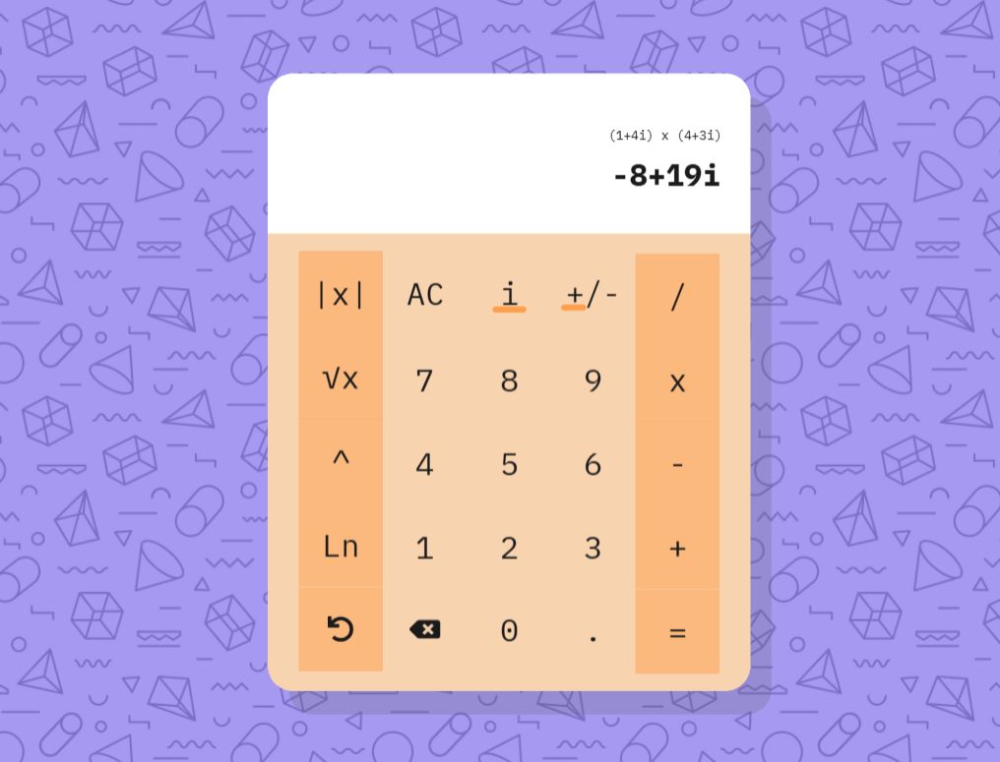

# Complex calculator
This is a project that seeks to make a page for dealing with complex operations as like adition, substraction, multiplication, division, exponentiation, natural log and square root.

The design is simple to understand and apealing to the view
